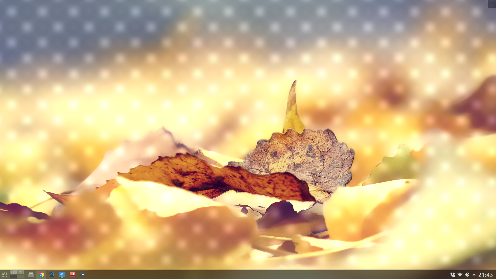
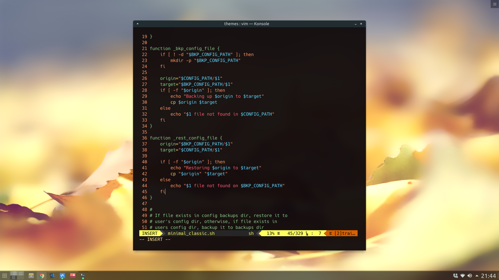
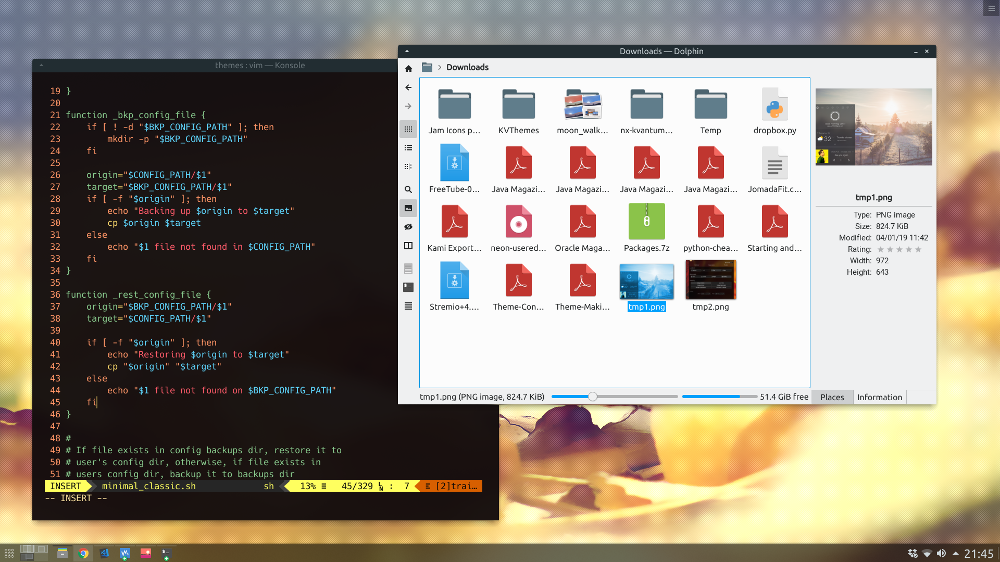
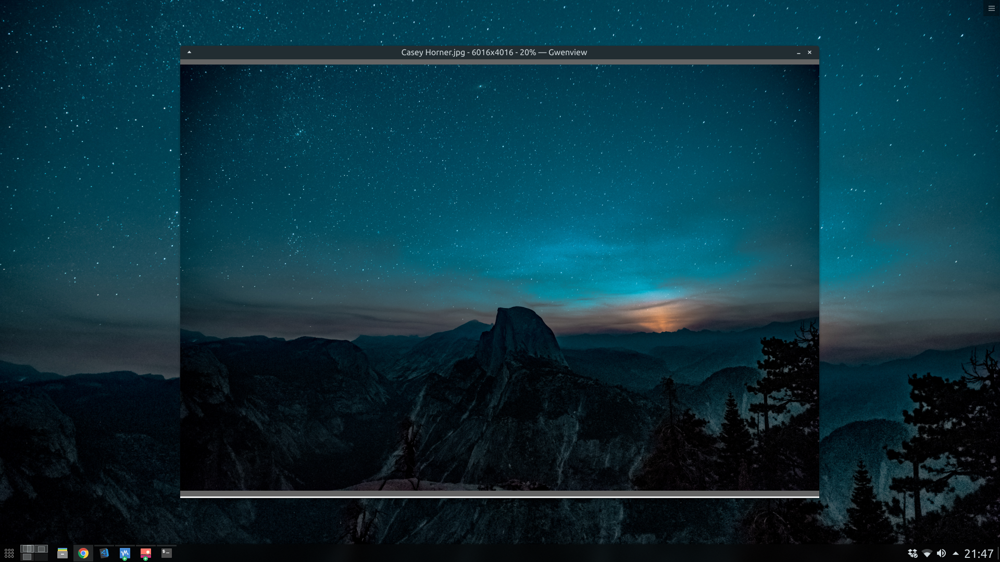

# KMinimalClassic
A KDE Minimalist classic appearance and layout

## Screenshots:

## Install:

## Dependencies:

## Pending to automate configs:
* Place windows centered on screen during opening
* Hide menu bar on Gwenview
* Setup task switcher to Big Icons only
* Setup wallpapers
* Setup mouse settings
* Vertical maximize shortcut is not working

